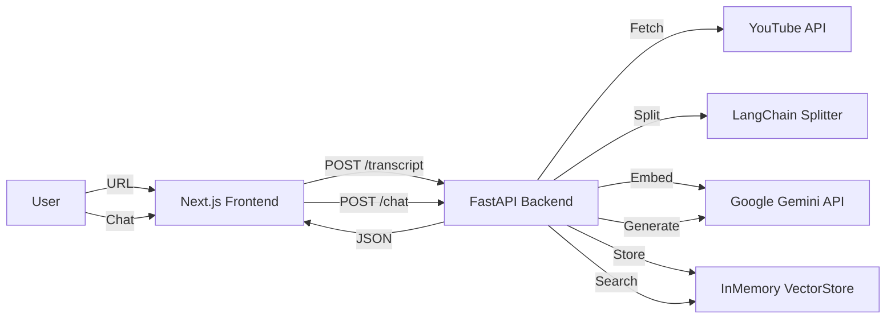

# RAG Agent Project Documentation

## Overview
This project is a **Retrieval-Augmented Generation (RAG) Agent** designed to process YouTube videos. It extracts transcripts, splits them into manageable chunks, generates vector embeddings using Google Gemini, and indexes them for semantic search. This lays the foundation for an AI assistant that can "chat" with video content.

## Architecture

The system follows a modern client-server architecture:



### Components
1.  **Frontend (Next.js)**: A responsive web interface for user interaction.
2.  **Backend (FastAPI)**: A high-performance Python API server.
3.  **Extraction Engine**: Uses `youtube-transcript-api` to fetch subtitles.
4.  **Processing Pipeline**:
    *   **Text Splitting**: Breaks transcripts into 1000-character chunks (200 overlap).
    *   **Embedding**: Converts text chunks into 768-dimensional vectors using `models/text-embedding-004`.
    *   **Indexing**: Stores vectors in an in-memory database for retrieval.
5.  **RAG Engine**:
    *   **Search Tool**: `/search` endpoint to find relevant chunks.
    *   **Chat Agent**: `/chat` endpoint that retrieves context and answers questions.

## Tech Stack

### Backend
-   **Language**: Python 3.11+
-   **Framework**: FastAPI (Server), Uvicorn (ASGI)
-   **AI & Logic**:
    -   `langchain`: Orchestration framework.
    -   `langchain-google-genai`: Google Gemini integration.
    -   `youtube-transcript-api`: Transcript fetching.
    -   `python-dotenv`: Environment variable management.

### Frontend
-   **Framework**: Next.js 16 (App Router)
-   **Language**: TypeScript
-   **Styling**: Tailwind CSS
-   **AI Integration**: Vercel AI SDK (`@ai-sdk/react`)
-   **Package Manager**: Yarn

## App Flow

1.  **User Input**: User enters a YouTube URL in the frontend.
2.  **API Request**: Frontend sends the URL to `http://localhost:8000/transcript`.
3.  **Transcript Extraction**:
    -   Backend attempts to fetch English subtitles.
    -   Falls back to other languages if English is unavailable.
4.  **Text Splitting**: The raw transcript is split into smaller, overlapping chunks.
5.  **Embedding Generation**:
    -   Each chunk is sent to Google Gemini's Embedding API.
    -   A vector representation is returned.
6.  **Vector Storage**: Vectors are stored in an `InMemoryVectorStore` for future similarity search.
7.  **Chat Interaction**:
    -   User asks a question via the chat interface.
    -   Backend searches the Vector Store for relevant chunks (RAG).
    -   Retrieved chunks are passed to the LLM as context.
    -   LLM generates an answer based *only* on the video content.

## Setup Instructions

### Prerequisites
-   Python 3.11+
-   Node.js & Yarn
-   Google Cloud API Key (for Gemini)

### Backend Setup
1.  Navigate to the project root.
2.  Create a `.env` file with your API key:
    ```env
    GOOGLE_API_KEY="your_api_key_here"
    ```
3.  Install dependencies:
    ```bash
    pip3 install fastapi uvicorn langchain langchain-community langchain-google-genai youtube-transcript-api python-dotenv
    ```
4.  Run the server:
    ```bash
    python3 server.py
    ```
    *Server runs on port 8000.*

### Frontend Setup
1.  Navigate to `frontend/`:
    ```bash
    cd frontend
    ```
2.  Install dependencies:
    ```bash
    yarn install
    ```
3.  Run the development server:
    ```bash
    npm run dev
    ```
    *App runs on port 9100.*

## Usage
1.  Open [http://localhost:9100](http://localhost:9100).
2.  Paste a YouTube URL (e.g., `https://www.youtube.com/watch?v=jNQXAC9IVRw`).
3.  Click **"Get Transcript"**.
4.  View the extracted transcript on the screen.
5.  Check the **backend terminal** to see:
    -   Transcript extraction logs.
    -   Raw embedding vector generation (proof of AI integration).
    -   Vector store verification results.
